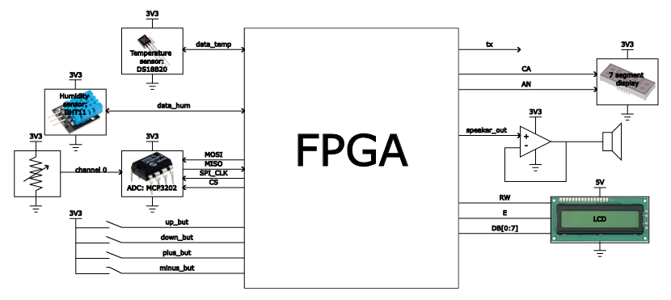
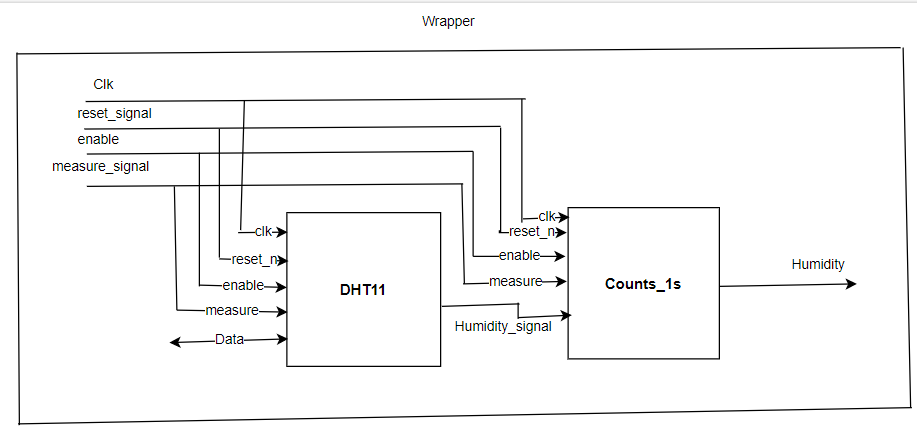

# 🌦️ FPGA-Based Weather Station

**Course:** Digital Project Laboratory (EDA234)  
**Institution:** Chalmers University of Technology, MPEES  
**Contributors:**  
- Jorge Muñoz Bautista  
- Divya Venigandla  
- Ritika Bora  
- Aravind Prasannanpillai Sreevilasam  
**Date:** January 2023  

---

## 🧾 Abstract

This project implements a **Weather Station** using **FPGA-based embedded systems**.  
The station measures environmental parameters such as **temperature**, **humidity**, and **air quality**, using respective sensors interfaced with an FPGA.  
The design is described in **VHDL** and verified using **ModelSim** and **Vivado**.  
The system features:
- Real-time data acquisition
- LCD and seven-segment display output
- UART communication for data transmission
- Alarm notification for hazardous air quality levels

---

## ⚙️ System Overview

The FPGA serves as the central controller interfacing with:
- **DS18B20** (Temperature Sensor)
- **DHT11** (Humidity Sensor)
- **TGS2600** + **MCP3202 ADC** (Air Quality Sensor)
- **LCD Display**
- **Seven-Segment Display**
- **UART Transmitter**
- **Speaker Alarm**

Each sensor has a dedicated FSM-based controller.  
The FPGA collects and processes data, converts it to human-reFdable format, and displays it or sends it over UART.

---

## 🧩 Subsystems Overview

### 🌡️ Temperature Sensor – DS18B20
- Digital thermometer (9–12 bit resolution)
- Communicates via **1-Wire bus**
- Operational range: **-55°C to +125°C**
- Implemented using **FSM-based VHDL controller**

---

### 💧 Humidity Sensor – DHT11
- Measures both temperature and humidity (used here for humidity)
- Communication via **single-wire protocol**
- 8-bit resolution with ±5% RH accuracy
- Sampling rate: 1 measurement every 2 seconds

---

### 🌫️ Air Quality Sensor – TGS2600 with MCP3202
- Detects **carbon monoxide and hydrogen** in ppm
- Outputs analog voltage proportional to gas concentration
- Interfaced via **12-bit SPI-based ADC (MCP3202)**
- FSM controls SPI data acquisition

---

### 🖥️ LCD Display
- DMC Series 8-bit single-line display
- Controlled via VHDL FSM using RS, RW, and Enable signals
- Displays temperature readings

---

### 🔤 UART Transmitter
- Baud rate: **9600 bps**
- Sends sensor readings to PC through FPGA’s USB-to-serial interface
- VHDL-based FSM handles frame generation

---

### 🔔 Alarm System
- Activated when air quality crosses threshold
- Implemented using XOR of two clock frequencies to generate tone
- Triggered via user-set threshold menu on FPGA

---

## 🧮 Error Analysis

| Sensor | Source of Error | Approx. Accuracy |
|---------|----------------|------------------|
| DS18B20 | Quantization (12-bit to integer truncation) | ±1°C |
| DHT11 | Internal resolution and nonlinearity | ±5% RH |
| TGS2600 | No calibration curve available | — |

---

## 🧰 Tools Used
- **Vivado Design Suite** – RTL design, synthesis, and implementation  
- **ModelSim** – Simulation and waveform verification  
- **Nexys A7-100T FPGA Board** – Hardware implementation  

---

## 🔌 Circuit and Wiring Diagrams

---

## 🧾 Bill of Materials

| Identifier | Component | Description | Qty |
|-------------|------------|--------------|-----|
| IC1 | DS18B20 | 1-Wire temperature sensor | 1 |
| IC2 | DHT11 | Humidity sensor | 1 |
| IC3 | MCP3202 | 12-bit SPI ADC | 1 |
| IC4 | Nexys4DDR FPGA Board | Main FPGA platform | 1 |
| IC5 | LM358 | Dual operational amplifier | 1 |
| IC7 | DMC16 LCD | Display module | 1 |
| R1 | Potentiometer 10kΩ | Analog input simulation | 1 |
| S1 | Speaker 16Ω | Audio alarm | 1 |

---

## 📚 References
1. DHT11 - Humidity & Temperature Sensor, OSEEP Electronics  
2. Programmable Resolution 1-Wire Digital Thermometer, Maxim Integrated  
3. “UART: A Hardware Communication Protocol,” Analog Dialogue, 2020  
4. Nexys4 DDR™ FPGA Board Reference Manual, Digilent  
5. MCP3202 ADC Datasheet, Microchip Technology  
6. TGS 2600 Gas Sensor Datasheet, Figaro  

---

## 💡 Future Work
- Add wireless data transmission (e.g., Bluetooth or Wi-Fi)
- Include additional sensors such as anemometer and seismometer
- Develop GUI for data visualization on PC

---

## 📸 Figures

All figures are stored in the `figures/` directory:

